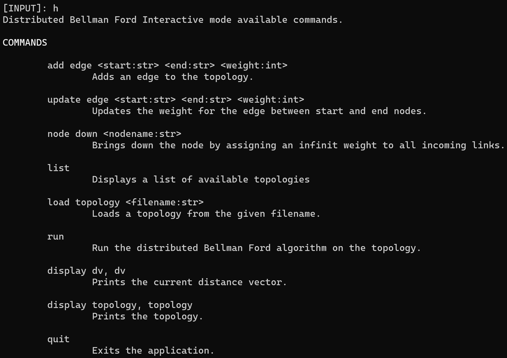

# A Simple Illustration of Distributed Bellman Ford Algorithm
This repository contains a simplified implementation of a distributed Bellman Ford algorithm.

Sample topologies and solutions are included and they can be executed through the CLI interface.

To run, clone the repository, install the requirements and then execute the main file either in `interactive` or `from_file` mode.

To run in `interactive mode`
```
python main.py --mode interactive
```

Once in the interactive mode, you can press `h` to see the list of available commands.



To run in `file_mode`
```
python main.py --mode from_file --filename SingleLoopTopo.txt
```

You can see the distance vector results after a run in the `out.txt` file.